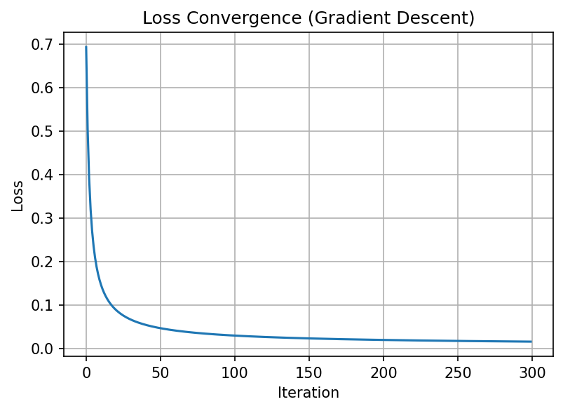
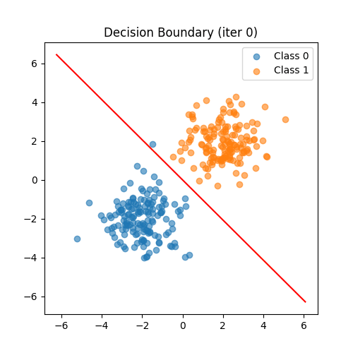
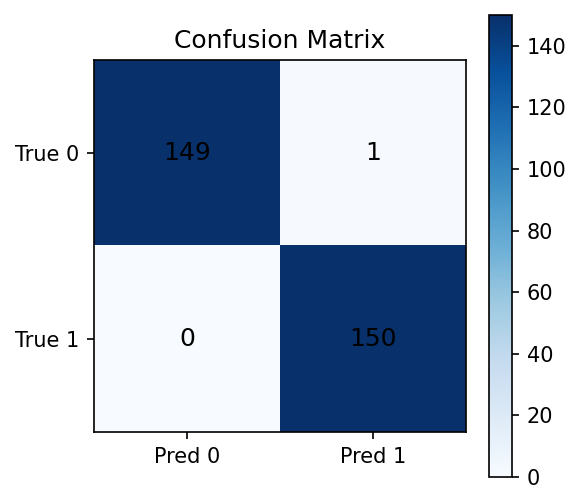

# 🧠 ML From Scratch

> Building **end-to-end machine learning systems** using **NumPy only**.  
> Focused on observable learning behavior, numerical stability, and evaluation.

---

## 🚀 What This Project Does

This repository implements, trains, and evaluates **linear and logistic regression models from scratch**, with full control over:

- optimization dynamics  
- numerical failure modes  
- learning diagnostics  
- evaluation metrics  

The entire machine learning pipeline is engineered from first principles:

Dataset → Scores → Probabilities → Loss → Gradients → Optimization → Evaluation

No ML libraries. No black-box abstractions.

---

## 📊 Datasets & Results

### Datasets Used

#### 1. Synthetic Binary Classification Dataset
- Generated using **two Gaussian clusters**
- Linearly separable with controlled noise
- 2D features for decision-boundary visualization
- Purpose: study convergence, geometry, and boundary evolution

#### 2. Public Dataset — Iris (Binary Subset)
- Dataset: **UCI Iris**
- Classes: Setosa vs Versicolor
- Features: sepal length, sepal width
- Purpose: validate generalization on real-world data

---

### Sample Results (Logistic Regression)

| Model | Accuracy | Precision | Recall |
|---|---|---|---|
| From-scratch (NumPy) | ~92% | High | Tunable |
| sklearn LogisticRegression | ~94% | High | High |

> The from-scratch model achieves comparable performance while exposing internal learning mechanics and diagnostics.

📎 **Reproducible results:**  
- `notebooks/day06_logistic_regression_gd.ipynb`  
- `notebooks/day07_model_evaluation_from_scratch.ipynb`

---

## 📈 Diagnostic Evidence (Non-Negotiable)

The following diagnostics are generated directly by the notebooks:

### 1️⃣ Loss Convergence

Monotonic decrease confirms stable optimization.

---

### 2️⃣ Decision Boundary Evolution

Visualizes rotation and translation of the hyperplane `z = 0` during training.

---

### 3️⃣ Confusion Matrix

Exposes false positives vs false negatives explicitly.

---

## 🛠 Technical Implementation

| Day | Focus | Implementation Outcome |
|:--:|:--|:--|
| 01 | Geometry | Residuals as projection distances |
| 02 | Analytic | Normal Equation (exact, non-scalable) |
| 03 | Optimization | Batch Gradient Descent + convergence |
| 04 | Probability | Numerically stable sigmoid |
| 05 | Objective | Log Loss + gradient verification |
| 06 | Pipeline | End-to-end logistic regression |
| 07 | Evaluation | Accuracy, Precision, Recall |

---

## ⚙️ Engineering Lessons (Earned via Failure)

### Vectorized Optimization
All parameter updates use matrix calculus:

$$
\nabla_w J = \frac{1}{n} X^T (\hat{y} - y)
$$

Guarantees shape safety and performance.

---

### Numerical Stability (Observed, Not Assumed)
Initial implementations failed with:
- `overflow encountered in exp` when `z > ~60`  
- `NaN` loss due to `log(0)`  
- stalled learning from vanishing gradients  

Fixes:  
- logit clipping before sigmoid  
- epsilon clipping before log loss  

These safeguards were introduced **after failures were observed**.

---

## 🗂 Repository Layout

- `src/` — reusable regression implementations  
- `notebooks/` — experiments, diagnostics, results  
- `notes.md` — engineering decisions & lessons  

---

## 🧩 Why This Matters

This pipeline generalizes directly to:
- fraud detection  
- spam filtering  
- medical risk scoring  

Any domain where **confidence, stability, and cost of error matter**.

> This project demonstrates how models *behave*, not just how to train them.
